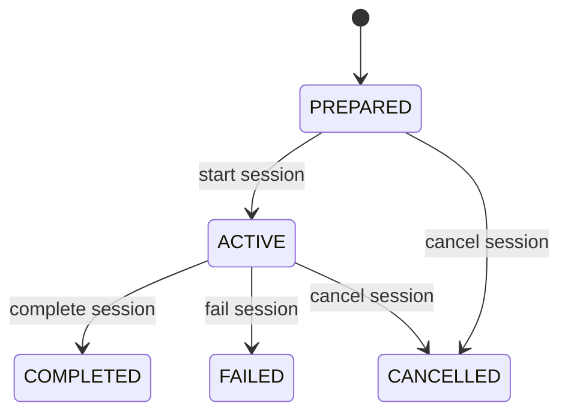

# State Diagram: Session Entity

This diagram illustrates the lifecycle and state transitions of a Session entity.

```mermaid
stateDiagram-v2
    [*] --> PREPARED
    PREPARED --> ACTIVE: start session
    ACTIVE --> COMPLETED: complete session
    ACTIVE --> FAILED: fail session
    PREPARED --> CANCELLED: cancel session
    ACTIVE --> CANCELLED: cancel session
```