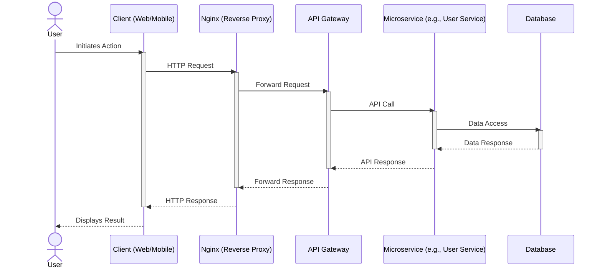
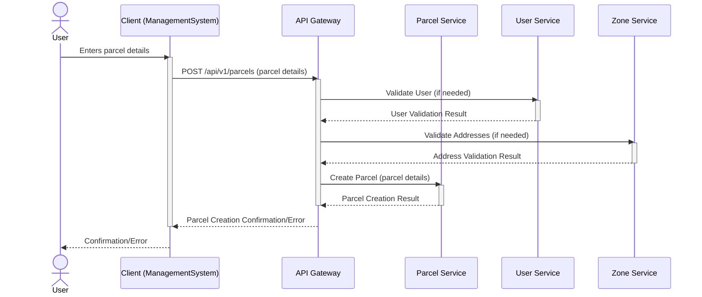
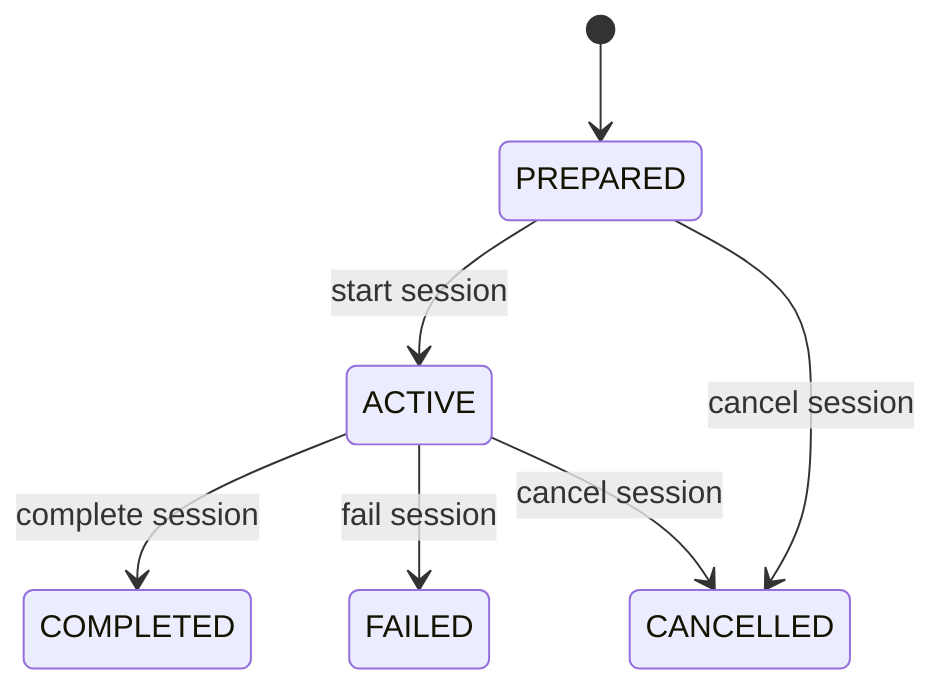

# System Analysis and Technical Assessment

This document provides a detailed technical analysis of the Delivery System, examining its architecture, workflows, identified issues, and recommendations for improvement.

## Table of Contents

- [System Architecture Overview](#system-architecture-overview)
- [System Workflows](#system-workflows)
- [Identified Issues and Recommendations](#identified-issues-and-recommendations)
- [Recommended Improvements](#recommended-improvements)
- [System Status Summary](#system-status-summary)
- [Testing and Quality Assurance Recommendations](#testing-and-quality-assurance-recommendations)
- [Conclusion](#conclusion)

## System Architecture Overview

The Delivery System is built using a microservices architecture pattern, where different functional areas are separated into independent services that communicate through well-defined interfaces.

### Entry Point and Routing

All external requests enter the system through an API Gateway running on port 21500. This gateway handles authentication using Keycloak, an identity and access management system, and then routes requests to the appropriate backend service. This centralized approach simplifies security management and provides a single point of entry for all client applications.

The following diagram illustrates the typical data flow through the system:

For detailed information about the API Gateway, see [API Gateway Documentation](2_BACKEND/1_API_GATEWAY.md).

### Core Services

The system consists of seven main services:

**User Service (port 21501)**: Manages user accounts, delivery personnel profiles, and synchronizes user data with Keycloak for authentication purposes. See [User Service Documentation](2_BACKEND/6_USER_SERVICE.md).

**Settings Service (port 21502)**: Provides centralized configuration management, allowing system administrators to update settings without modifying individual service configurations. See [Settings Service Documentation](2_BACKEND/5_SETTINGS_SERVICE.md).

**Zone Service (port 21503)**: Handles geographic data, delivery zone definitions, and integrates with OSRM (Open Source Routing Machine) to calculate optimal delivery routes. See [Zone Service Documentation](2_BACKEND/7_ZONE_SERVICE.md).

**Parcel Service**: Manages the complete lifecycle of parcels from creation to final delivery confirmation. This service coordinates with User Service for customer information, Zone Service for routing data, and Session Service for delivery assignments. See [Parcel Service Documentation](2_BACKEND/3_PARCEL_SERVICE.md).

**Session Service**: Coordinates delivery sessions, which are collections of parcel assignments given to a delivery person. This service tracks the status of each assignment and emits events when assignments are created, updated, or completed. See [Session Service Documentation](2_BACKEND/4_SESSION_SERVICE.md).

**Communication Service**: Provides real-time messaging capabilities through WebSocket connections, enabling instant communication between administrators, delivery personnel, and clients. This service also handles interactive proposals for actions like postponing deliveries. See [Communication Service Documentation](2_BACKEND/2_COMMUNICATION_SERVICE.md).

### Supporting Infrastructure

**Kafka Message Broker**: Used for event-driven communication between services. When a parcel status changes or a delivery session is updated, events are published to Kafka topics, allowing other services to react to these changes asynchronously.

**Keycloak**: Handles user authentication and authorization, providing single sign-on capabilities and role-based access control.

**OSRM Integration**: External service used for calculating optimal delivery routes based on geographic coordinates.

### Client Applications

**Management System**: A web-based application built with Vue.js and Nuxt UI framework. This application serves both administrators and clients, with different interfaces and permissions based on user roles. Administrators can manage parcels, sessions, users, and system settings. Clients can create parcels, track their deliveries, and communicate with delivery personnel. See [Management System Documentation](1_CLIENTS/1_MANAGEMENT_SYSTEM.md).

**Delivery App**: An Android mobile application used by delivery personnel. This app allows drivers to scan parcel QR codes, manage delivery sessions, update delivery status, navigate to delivery locations, and communicate with administrators and clients in real-time. See [Delivery App Documentation](1_CLIENTS/2_DELIVERY_APP.md).

## System Workflows

### Version 0: Basic Scan and Accept

The simplest workflow allows delivery personnel to scan a parcel QR code using the mobile app. The app sends a request to create or update a delivery session, and the parcel status is automatically updated to indicate it is on route. This basic flow provides minimal functionality but demonstrates core system capabilities.

### Version 1: Full Collaboration (Current Implementation)

The current system implementation provides comprehensive collaboration features:

**Parcel Creation**: Administrators or clients can create parcels through the web interface. The system stores destination information and automatically determines which delivery zones the parcel belongs to. The following diagram illustrates the parcel creation workflow:

For more detailed parcel workflows, see [Parcel Workflows Documentation](3_APIS_AND_FUNCTIONS/diagrams/parcel_workflows.md).

**Session Planning**: Delivery sessions can be created in two ways. Administrators can proactively create sessions and assign parcels to delivery personnel, or delivery personnel can create their own sessions when they start their delivery route. The following diagram shows the session lifecycle:

For more detailed session workflows, see [Session Workflows Documentation](3_APIS_AND_FUNCTIONS/diagrams/session_workflows.md).

**Execution**: During delivery, the mobile app displays the list of assigned parcels. Delivery personnel can update the status of each parcel as they progress through their route. Route information is retrieved from the Zone Service to help optimize delivery order.

**Real-time Coordination**: The Communication Service enables instant messaging and interactive proposals. For example, if a delivery needs to be postponed, the delivery person can send a proposal that administrators or clients can approve or decline through the web interface.

**Completion and Confirmation**: When a delivery person marks a parcel as successfully delivered, the parcel status changes to indicate completion. Administrators or clients can then confirm receipt, which finalizes the delivery process and updates all related records.

**Event Broadcasting**: All status changes are published as events through Kafka, ensuring that all parts of the system stay synchronized. The web interface and mobile app receive real-time updates through WebSocket connections.

### Version 2: Enhanced Features (Planned)

Future enhancements include advanced filtering and querying capabilities. All list endpoints will support complex filter operations, allowing users to find specific parcels or sessions based on multiple criteria. The mobile app will also support offline operation, queuing status updates when network connectivity is unavailable.

## Identified Issues and Recommendations

### Critical Issues

**Missing Assignment Identifier in Postpone Requests**: When delivery personnel request to postpone a delivery, the mobile app currently only sends the parcel identifier, not the assignment identifier. This causes the backend system to update incorrect records. The fix requires modifying the mobile app to include both identifiers in the request payload.

**Limited Session Query Capabilities**: The current API only returns active delivery sessions. There is no way to retrieve historical sessions or exclude specific parcels from the results. This limitation affects the web interface when clients want to view a delivery person's history while excluding the current parcel they are discussing. The solution involves adding query parameters to filter results and creating a separate endpoint for historical data.

**Missing Parcel Filtering by Delivery Person**: Clients cannot filter their parcel list to show only parcels delivered by a specific delivery person. This feature is needed for scenarios where clients want to track all deliveries from a particular driver. The fix requires extending the Parcel Service search functionality to accept delivery person identifiers and updating the web interface to provide filter options.

**Missing Confirmation Actions**: After a delivery person marks a parcel as successfully delivered, there is no user interface element for administrators or clients to confirm receipt. While the backend API supports this functionality, the frontend applications lack the necessary buttons and actions. The solution involves adding confirmation buttons to the appropriate screens in both the web and mobile applications.

### Service-Specific Observations

**Session Service**: The service supports creating, starting, completing, and failing delivery assignments, but lacks a dedicated endpoint for postponing assignments. Adding this endpoint would improve the system's ability to handle delivery schedule changes.

**Parcel Service**: The service needs enhanced confirmation workflows. Currently, there are separate endpoints for administrator and client confirmations, but the status tracking could be improved to distinguish between different types of delays and confirmations.

**Communication Service**: The service acts as both a WebSocket gateway and handles HTTP-based proposals. The system should enforce that all proposal responses include both parcel and assignment identifiers to maintain data consistency.

**Settings Service**: While data transfer objects exist for configuration management, the controller layer is incomplete. Completing this implementation is important to prevent configuration data from being exposed through other service endpoints.

**API Gateway**: The gateway needs routing updates to support new confirmation and postponement endpoints. Additionally, version 2 API proxies should be verified to ensure backward compatibility is maintained.

### Application-Specific Observations

**Delivery App (Mobile)**: The application uses Retrofit, a networking library, to communicate with backend services. The chat functionality injects parcel identifiers into postpone requests but does not include assignment identifiers. The WebSocket message handler forwards payloads without validation, which could lead to inconsistent data. The application would benefit from server-side schema validation.

**Management System (Web)**: The web application combines data from multiple API endpoints to display delivery sessions and assignments. However, the current implementation cannot distinguish between active and historical sessions, and cannot exclude specific parcels from the view. The parcel list filtering is limited to receiver identifiers and does not support filtering by delivery person.

## Recommended Improvements

### Priority 1: Fix Critical Data Flow Issues

1. **Update Mobile App Proposal Handling**: Modify the chat activity to include both parcel and assignment identifiers when responding to postpone proposals. This ensures the backend can correctly identify which assignment to update.

2. **Enhance Session API**: Add query parameters to the session retrieval endpoint to support excluding specific parcels and retrieving historical sessions. Create a separate endpoint for session history to avoid confusion.

3. **Extend Parcel Filtering**: Implement delivery person filtering in the Parcel Service and add corresponding user interface elements in the web application.

### Priority 2: Complete Missing User Interface Elements

1. **Add Confirmation Buttons**: Implement confirmation actions in both the web and mobile applications. These should appear when a parcel status indicates successful delivery, allowing administrators and clients to finalize the delivery process.

2. **Improve Session Management Interface**: Enhance the web interface to clearly distinguish between active and historical sessions, and provide better filtering options.

### Priority 3: Service Enhancements

1. **Complete Settings Service**: Finish implementing the controller layer for the Settings Service to ensure proper configuration management.

2. **Add Postponement Endpoint**: Create a dedicated endpoint in the Session Service for handling assignment postponements, with proper event emission for other services to react.

3. **Enhance API Gateway Routing**: Update routing rules to support all new endpoints and verify version 2 API compatibility.

## System Status Summary

### Completed Components

- Core microservices architecture with seven functional services
- API Gateway with authentication and routing
- Real-time communication through WebSocket
- Event-driven updates through Kafka
- Web-based management interface for administrators and clients
- Mobile application for delivery personnel
- Basic parcel lifecycle management
- Delivery session coordination
- Route calculation integration

### In Progress Components

- Advanced filtering and querying capabilities (Version 2 APIs)
- Offline support for mobile application
- Enhanced monitoring and observability

### Pending Components

- Complete Settings Service implementation
- Missing user interface confirmation actions
- Enhanced session query capabilities
- Cross-service filtering improvements

## Testing and Quality Assurance Recommendations

The following areas should be prioritized for testing:

1. **End-to-End Workflow Testing**: Verify complete parcel lifecycle from creation through delivery confirmation, ensuring all services coordinate correctly.

2. **Real-time Communication Testing**: Test WebSocket connections under various network conditions and verify that all parties receive updates promptly.

3. **Data Consistency Testing**: Ensure that status updates propagate correctly through Kafka events and that all services maintain consistent data.

4. **Security Testing**: Verify that authentication and authorization work correctly across all services and that users can only access data appropriate to their roles.

5. **Performance Testing**: Evaluate system behavior under load, particularly focusing on the API Gateway and Kafka message processing.

## Conclusion

The Delivery System demonstrates a well-structured microservices architecture with clear separation of concerns. The implementation provides comprehensive functionality for managing parcel deliveries with real-time coordination capabilities. The identified issues are primarily related to user interface completeness and API enhancements rather than fundamental architectural problems.

With the recommended improvements implemented, the system will provide a robust, scalable solution for delivery management with enhanced user experience and operational efficiency. The event-driven architecture provides a solid foundation for future enhancements and scalability requirements.

For more detailed information about specific components, see:
- [System Overview](0_SYSTEM_OVERVIEW.md)
- [Backend Services Documentation](2_BACKEND/)
- [Client Applications Documentation](1_CLIENTS/)
- [API Documentation](3_APIS_AND_FUNCTIONS/README.md)
- [Features Documentation](features/README.md)
