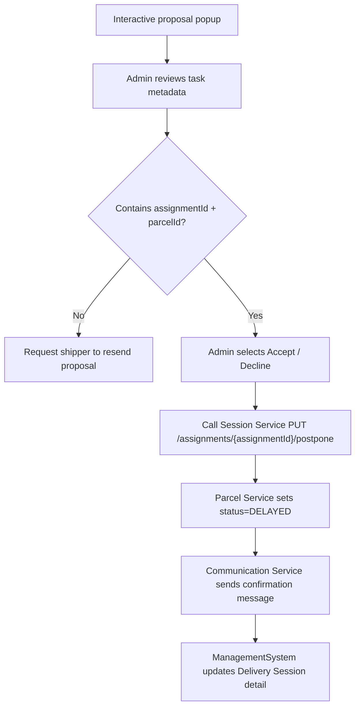
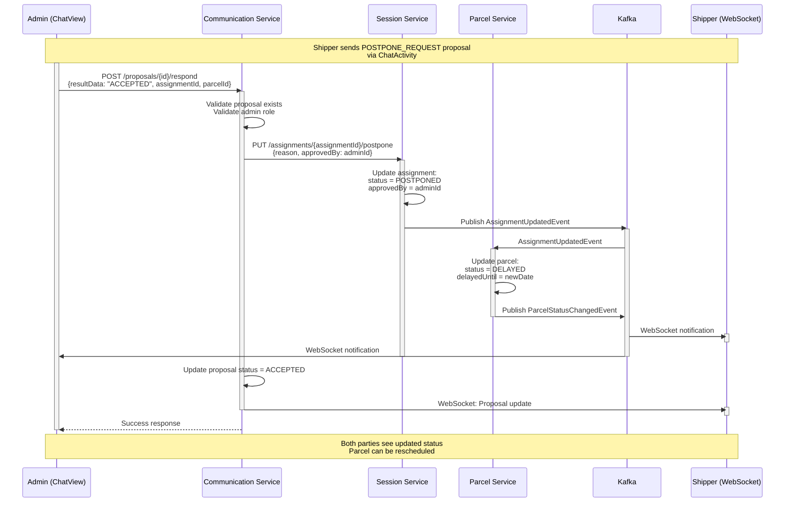

**Navigation**: [ Back to admin Features](README.md) | [ Features Index](../README.md) | [ Report Index](../../README.md)

---

# Admin: Approve Postpone Request

**Version**: v1  
**Module**: `ManagementSystem/src/modules/Communication`  
**Related**: See `../../SYSTEM_ANALYSIS.md` for system analysis and recommendations

## Overview

Admin reviews and approves/declines postpone requests from shippers via interactive proposals in chat. This flow updates assignment status to `POSTPONED` and marks parcel as `DELAYED`.

## Activity Diagram

## Sequence Diagram

## Implementation Notes

- **UI**: Interactive proposal popup in `ChatView.vue` when shipper sends `POSTPONE_REQUEST`.
- **Validation**: Proposal must contain both `assignmentId` and `parcelId` in `resultData`.
- **Backend**: Session Service should expose idempotent postpone endpoint tied to assignment.

## API References

- **Communication Service**: `POST /api/v1/proposals/{id}/respond` (see [Communication Service V1 PROPOSAL_CONTROLLER Controller](../../3_APIS_AND_FUNCTIONS/apis/communication-service/v1/COMMUNICATION_SERVICE_V1_PROPOSAL_CONTROLLER.md))
- **Session Service**: `PUT /api/v1/assignments/{assignmentId}/postpone` (to be implemented, see `../../SYSTEM_ANALYSIS.md`)

## Code References

- **Frontend**: `ManagementSystem/src/modules/Communication/ChatView.vue`
- **Backend Communication**: `BE/communication_service/src/main/java/com/ds/communication_service/application/controllers/ProposalController.java`
- **Backend Session**: `BE/session-service/src/main/java/com/ds/session/session_service/application/controllers/DeliveryAssignmentController.java`

## Known Issues & Fixes Required

1. **Missing assignmentId in proposal response** (see `../../SYSTEM_ANALYSIS.md` section 3):
   - DeliveryApp must send both `assignmentId` + `parcelId` when responding to postpone proposals
   - Fix: Update `ChatActivity#onProposalRespond` to include `assignmentId` in `resultData`

2. **Missing postpone endpoint**:
   - Session Service should expose `PUT /api/v1/assignments/{assignmentId}/postpone`
   - Fix: Implement endpoint in `DeliveryAssignmentController` (see `../../SYSTEM_ANALYSIS.md` section 4)

---

**Navigation**: [ Back to admin Features](README.md) | [ Features Index](../README.md) | [ Report Index](../../README.md)
