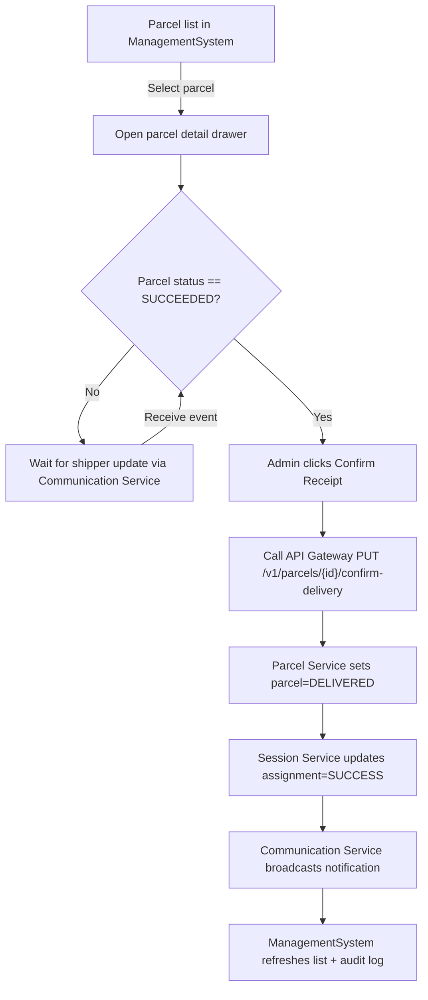
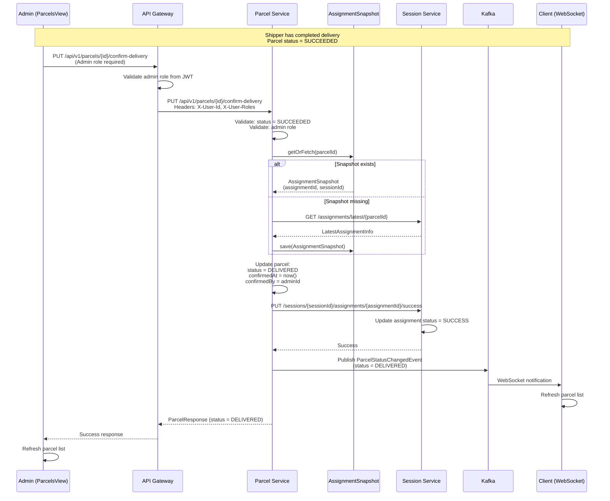

**Navigation**: [ Back to admin Features](README.md) | [ Features Index](../README.md) | [ Report Index](../../README.md)

---

# Admin: Confirm Delivery Completion

**Version**: v1  
**Module**: `ManagementSystem/src/modules/Parcels`  
**Related**: See `../../SYSTEM_ANALYSIS.md` for system analysis

## Overview

Admin confirms delivery completion after shipper has marked parcel as successfully delivered. This flow updates parcel status to `DELIVERED` and marks the corresponding assignment as `SUCCESS`.

## Activity Diagram

## Sequence Diagram

## Implementation Notes

- **UI hook**: Add action button to `ParcelsView.vue` (admin scope) and to chat sidebar when conversing with the shipper (proposal confirmation).
- **Backend**: Expose `PUT /v1/parcels/{id}/confirm-delivery` in Parcel Service + propagate assignment update through Session Service.
- **Audit**: Reuse `AUDIT_LOGGING_GUIDE.md` patterns (BE).
- **Cross-service communication**: Uses `AssignmentSnapshot` for efficient cross-service communication (same pattern as client confirmation).

## API References

- **Gateway**: `PUT /api/v1/parcels/{id}/confirm-delivery` (see [API Gateway V1 PARCEL_SERVICE_CONTROLLER Controller](../../3_APIS_AND_FUNCTIONS/apis/api-gateway/v1/V1_PARCEL_SERVICE_CONTROLLER.md))
- **Parcel Service**: `PUT /api/v1/parcels/{id}/confirm-delivery` (see `reports/2_BACKEND/3_PARCEL_SERVICE.md`)
- **Session Service**: `PUT /api/v1/sessions/{sessionId}/assignments/{assignmentId}/success` (see `reports/2_BACKEND/4_SESSION_SERVICE.md`)

## Code References

- **Frontend**: `ManagementSystem/src/modules/Parcels/ParcelsView.vue`
- **Backend**: `BE/parcel-service/src/main/java/com/ds/parcel_service/application/controllers/ParcelController.java`
- **Business Logic**: `BE/parcel-service/src/main/java/com/ds/parcel_service/business/v1/services/ParcelService.java`

## Known Issues

- Currently missing UI button for admin confirmation (see `../../SYSTEM_ANALYSIS.md` section 4)
- Backend endpoint exists but needs UI integration

---

**Navigation**: [ Back to admin Features](README.md) | [ Features Index](../README.md) | [ Report Index](../../README.md)