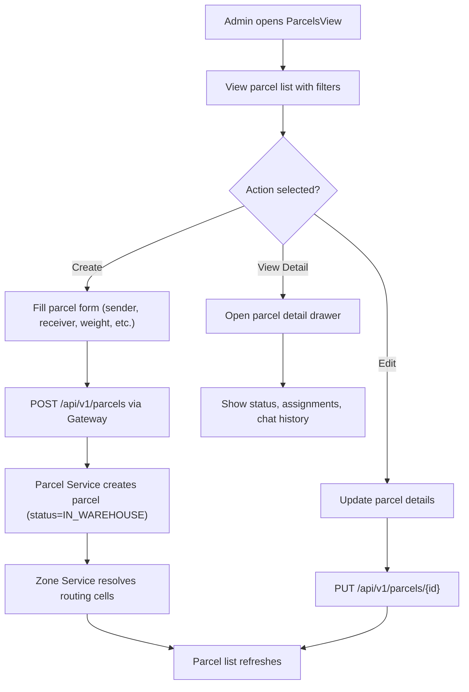

**Navigation**: [← Back to Admin Features](README.md) | [↑ Features Index](../README.md) | [↑ Report Index](../../README.md)

---

# Admin: Create and Manage Parcels

**Version**: v1  
**Module**: `ManagementSystem/src/modules/Parcels`  
**Related**: See [Parcel Service Documentation](../../2_BACKEND/3_PARCEL_SERVICE.md) for service details

## Overview

Administrators can create, edit, view, and manage parcels through the Parcels module. Parcels are created with status `IN_WAREHOUSE` and can be assigned to delivery sessions.

## Activity Diagram

For detailed parcel creation workflow, see [Parcel Workflows Documentation](../../3_APIS_AND_FUNCTIONS/diagrams/parcel_workflows.md).

## API References

**Gateway**: 
- `POST /api/v1/parcels` - Create parcel
- `PUT /api/v1/parcels/{id}` - Update parcel
- `GET /api/v1/parcels` - List parcels with filters
- See [API Gateway Parcel Controller](../../3_APIS_AND_FUNCTIONS/apis/api-gateway/v1/V1_PARCEL_SERVICE_CONTROLLER.md)

**Parcel Service**: 
- V0, V1, and V2 controllers available
- See [Parcel Service API Documentation](../../3_APIS_AND_FUNCTIONS/apis/parcel-service/README.md)

## Code References

**Frontend**: `ManagementSystem/src/modules/Parcels/ParcelsView.vue`  
**API Client**: `ManagementSystem/src/modules/Parcels/api.ts`  
**Backend**: `BE/parcel-service/src/main/java/com/ds/parcel_service/application/controllers/ParcelController.java`

## Features

- **CRUD Operations**: Full create, read, update, delete support
- **Status Tracking**: View parcel status transitions (IN_WAREHOUSE → ON_ROUTE → SUCCEEDED → DELIVERED)
- **Filtering**: V2 filter system for advanced queries (where implemented)
- **Detail View**: Shows assignments, chat history, status timeline

## Known Gaps

- Missing V2 filter wiring on UI (API ready in backend)
- No admin confirmation action (see [Confirm Delivery](confirm-delivery.md))
- No tie-in with chat events for real-time updates

## Related Documentation

- [Parcel Service](../../2_BACKEND/3_PARCEL_SERVICE.md) - Backend service documentation
- [Parcel Workflows](../../3_APIS_AND_FUNCTIONS/diagrams/parcel_workflows.md) - Complete parcel operation workflows
- [API Documentation](../../3_APIS_AND_FUNCTIONS/README.md) - Complete API reference

---

**Navigation**: [← Back to Admin Features](README.md) | [↑ Features Index](../README.md) | [↑ Report Index](../../README.md)
