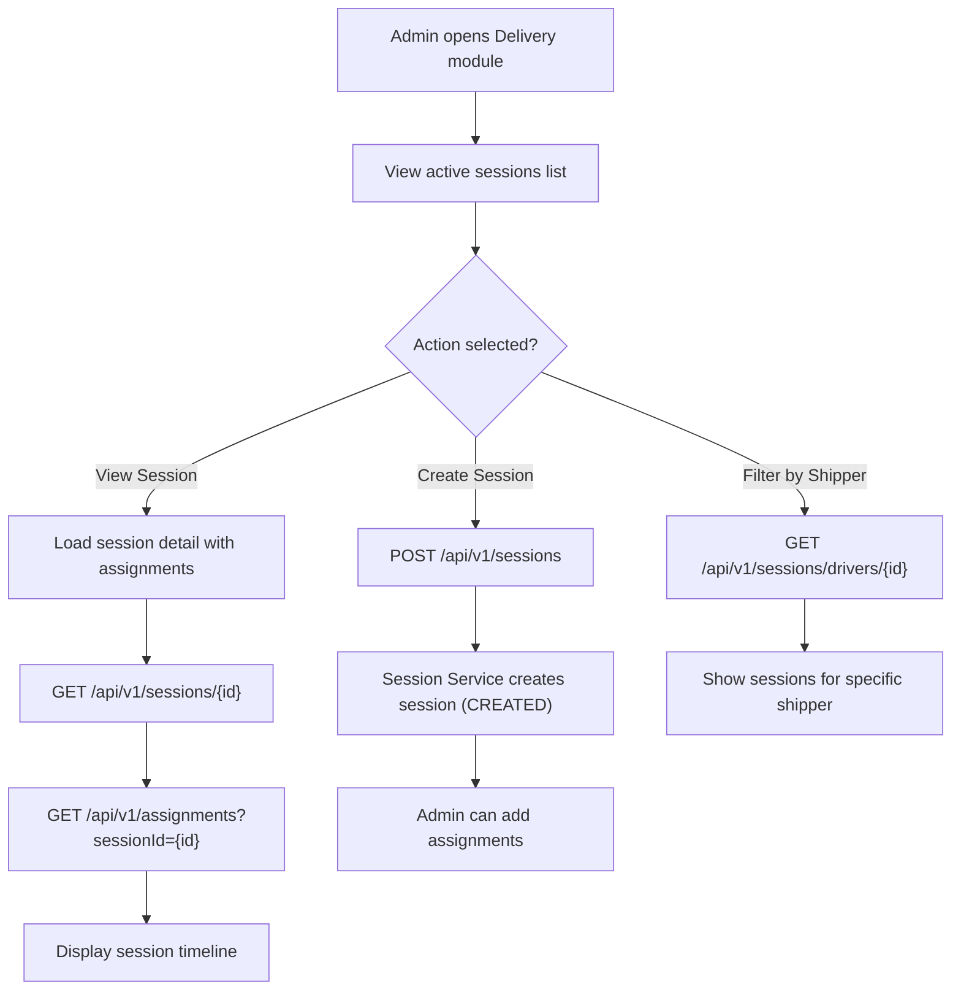

**Navigation**: [ Back to admin Features](README.md) | [ Features Index](../README.md) | [ Report Index](../../README.md)

---

# Admin: Manage Delivery Sessions

**Version**: v1  
**Module**: `ManagementSystem/src/modules/Delivery`  
**Related**: See `reports/2_BACKEND/4_SESSION_SERVICE.md` for service details

## Overview

Admin can view, create, and manage delivery sessions. Sessions contain multiple assignments (parcels) and track delivery progress for shippers.

## Activity Diagram

## API References

- **Gateway**: 
  - `GET /api/v1/sessions` - List sessions
  - `POST /api/v1/sessions` - Create session
  - `GET /api/v1/sessions/{id}` - Get session detail
  - `GET /api/v1/sessions/drivers/{id}` - Get sessions for shipper
  - See [API Gateway V1 DELIVERY_SESSION_CONTROLLER Controller](../../3_APIS_AND_FUNCTIONS/apis/api-gateway/v1/V1_DELIVERY_SESSION_CONTROLLER.md)

- **Session Service**: 
  - V1/V2 controllers available
  - See [Session Service Controllers](../../3_APIS_AND_FUNCTIONS/apis/session-service/README.md)

## Code References

- **Frontend**: `ManagementSystem/src/modules/Delivery/`
- **Composable**: `ManagementSystem/src/modules/Delivery/composables/useDeliverySessions.ts`
- **Backend**: `BE/session-service/src/main/java/com/ds/session/session_service/application/controllers/SessionController.java`

## Known Issues

1. **Only active session returned** (see `../../SYSTEM_ANALYSIS.md` section 3):
   - Cannot request "all sessions" or exclude current parcel
   - Fix: Add `excludeParcelId` query param to `GET /v1/sessions/drivers/{id}/active`

2. **Missing history endpoint**:
   - Need separate endpoint for session history vs active sessions
   - Fix: Add `GET /api/v1/sessions/drivers/{id}/history` endpoint

3. **Shipper-client filter missing**:
   - Cannot filter sessions by both shipper and client
   - Fix: Extend filter system to support cross-service joins

## Features

- **Session List**: View all active delivery sessions
- **Session Detail**: View assignments, timeline, status
- **Create Session**: Manually create sessions and assign parcels
- **Filter by Shipper**: View sessions for specific delivery person

---

**Navigation**: [ Back to admin Features](README.md) | [ Features Index](../README.md) | [ Report Index](../../README.md)