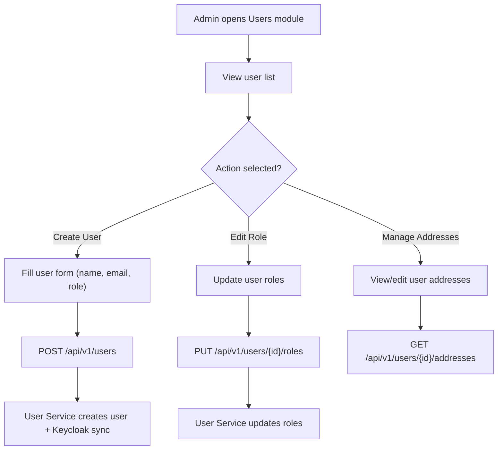

**Navigation**: [ Back to admin Features](README.md) | [ Features Index](../README.md) | [ Report Index](../../README.md)

---

# Admin: User & Role Management

**Version**: v1  
**Module**: `ManagementSystem/src/modules/Users`  
**Related**: See `reports/2_BACKEND/6_USER_SERVICE.md` for service details

## Overview

Admin can create, edit, and manage users and their roles. User creation syncs with Keycloak for authentication.

## Activity Diagram

## API References

- **Gateway**: 
  - `GET /api/v1/users` - List users
  - `POST /api/v1/users` - Create user
  - `PUT /api/v1/users/{id}` - Update user
  - `PUT /api/v1/users/{id}/roles` - Update roles
  - `GET /api/v1/users/{id}/addresses` - Get user addresses
  - See [API Gateway V1 USER_CONTROLLER Controller](../../3_APIS_AND_FUNCTIONS/apis/api-gateway/v1/V1_USER_CONTROLLER.md)

- **User Service**: 
  - V0/V1/V2 controllers available
  - See [User Service Controllers](../../3_APIS_AND_FUNCTIONS/apis/user-service/README.md)

## Code References

- **Frontend**: `ManagementSystem/src/modules/Users/`
- **Backend**: `BE/User_service/src/main/java/`

## Features

- **User CRUD**: Create, read, update, delete users
- **Role Management**: Assign and update user roles (ADMIN, CLIENT, SHIPPER)
- **Address Management**: View and edit user addresses
- **Keycloak Sync**: Automatic synchronization with Keycloak IAM

## Known Gaps

- Missing V2 filter wiring on UI (API ready in BE)
- Need bulk operations for role updates

---

**Navigation**: [ Back to admin Features](README.md) | [ Features Index](../README.md) | [ Report Index](../../README.md)