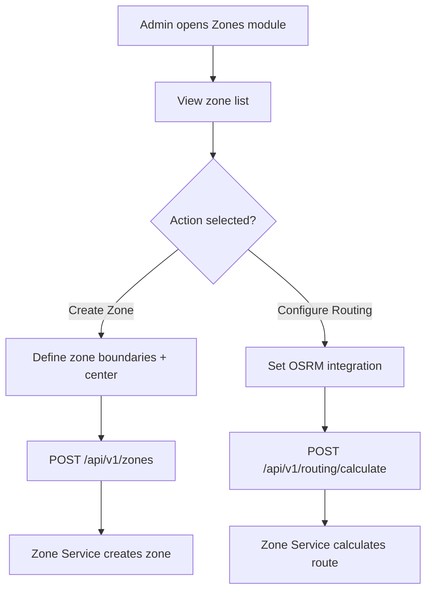

**Navigation**: [ Back to admin Features](README.md) | [ Features Index](../README.md) | [ Report Index](../../README.md)

---

# Admin: Manage Zones & Routing

**Version**: v1  
**Module**: `ManagementSystem/src/modules/Zones`  
**Related**: See `reports/2_BACKEND/7_ZONE_SERVICE.md` for service details

## Overview

Admin can create and manage delivery zones, configure routing, and integrate with OSRM for route calculation.

## Activity Diagram

## API References

- **Gateway**: 
  - `GET /api/v1/zones` - List zones
  - `POST /api/v1/zones` - Create zone
  - `PUT /api/v1/zones/{id}` - Update zone
  - `POST /api/v1/routing/calculate` - Calculate route
  - See [API Gateway V1 ZONE_PROXY_CONTROLLER Controller](../../3_APIS_AND_FUNCTIONS/apis/api-gateway/v1/V1_ZONE_PROXY_CONTROLLER.md)

- **Zone Service**: 
  - V1/V2 routers available
  - See [Zone Service Routers](../../3_APIS_AND_FUNCTIONS/apis/zone-service/README.md)

## Code References

- **Frontend**: `ManagementSystem/src/modules/Zones/`
- **Backend**: `BE/zone_service/src/`

## Features

- **Zone Management**: Create, edit, delete delivery zones
- **Routing Configuration**: Set up OSRM integration
- **Route Calculation**: Calculate routes between addresses
- **Zone Boundaries**: Define geographic boundaries for delivery areas

## Status

- OSRM integration complete
- Needs monitoring and performance tracking

---

**Navigation**: [ Back to admin Features](README.md) | [ Features Index](../README.md) | [ Report Index](../../README.md)