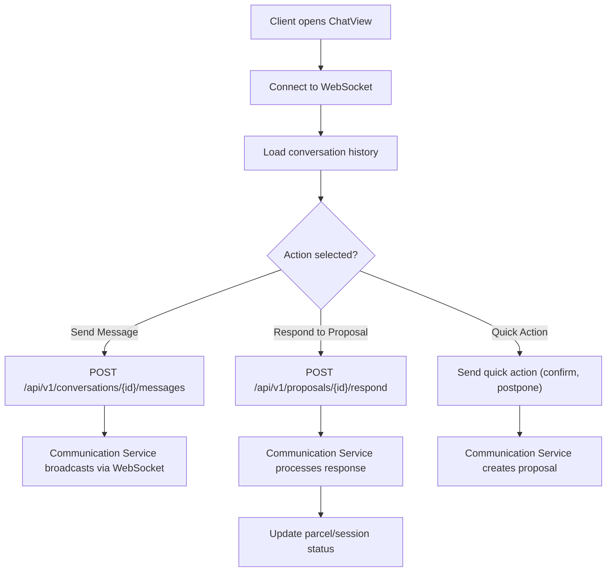

**Navigation**: [ Back to client Features](README.md) | [ Features Index](../README.md) | [ Report Index](../../README.md)

---

# Client: Chat & Proposals

**Version**: v1  
**Module**: `ManagementSystem/src/modules/Communication`  
**Related**: See `reports/2_BACKEND/2_COMMUNICATION_SERVICE.md` for service details

## Overview

Client can communicate with shippers and admins via real-time chat. Interactive proposals allow quick actions like confirming deliveries or responding to postpone requests.

## Activity Diagram

## Code References

- **Frontend**: `ManagementSystem/src/modules/Communication/ChatView.vue`
- **WebSocket**: `ManagementSystem/src/modules/Communication/composables/useWebSocket.ts`
- **Backend**: `BE/communication_service/src/main/java/com/ds/communication_service/application/controllers/ConversationController.java`

## API References

- **Gateway**: 
  - `GET /api/v1/conversations` - List conversations
  - `POST /api/v1/conversations/{id}/messages` - Send message
  - `POST /api/v1/proposals/{id}/respond` - Respond to proposal
  - See [API Gateway V1 COMMUNICATION_CONTROLLER Controller](../../3_APIS_AND_FUNCTIONS/apis/api-gateway/v1/V1_COMMUNICATION_CONTROLLER.md)

- **Communication Service**: 
  - V1 controllers (see [Communication Service V1 Controllers](../../3_APIS_AND_FUNCTIONS/apis/communication-service/v1/))

## Features

- **Real-time Chat**: WebSocket-based messaging
- **Interactive Proposals**: Quick actions for common tasks
- **Message History**: Load and display conversation history
- **Notifications**: Receive real-time notifications for parcel updates

## Known Issues

- No inline parcel confirmation controls (see `../../SYSTEM_ANALYSIS.md` section 3)
- Missing "exclude current parcel" parameter when loading shipper sessions

## Backlog

- Support quick actions from chat to open `ParcelDetail` drawer
- Add proposal templates for common scenarios
- Implement read receipts and typing indicators

---

**Navigation**: [ Back to client Features](README.md) | [ Features Index](../README.md) | [ Report Index](../../README.md)