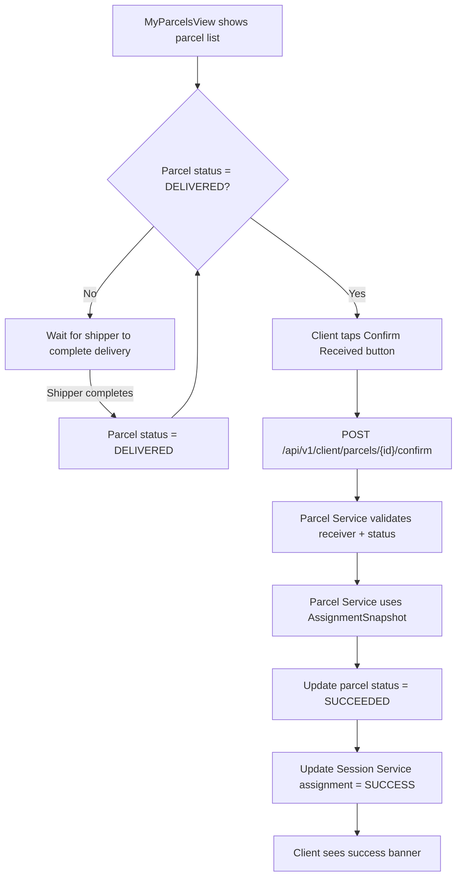
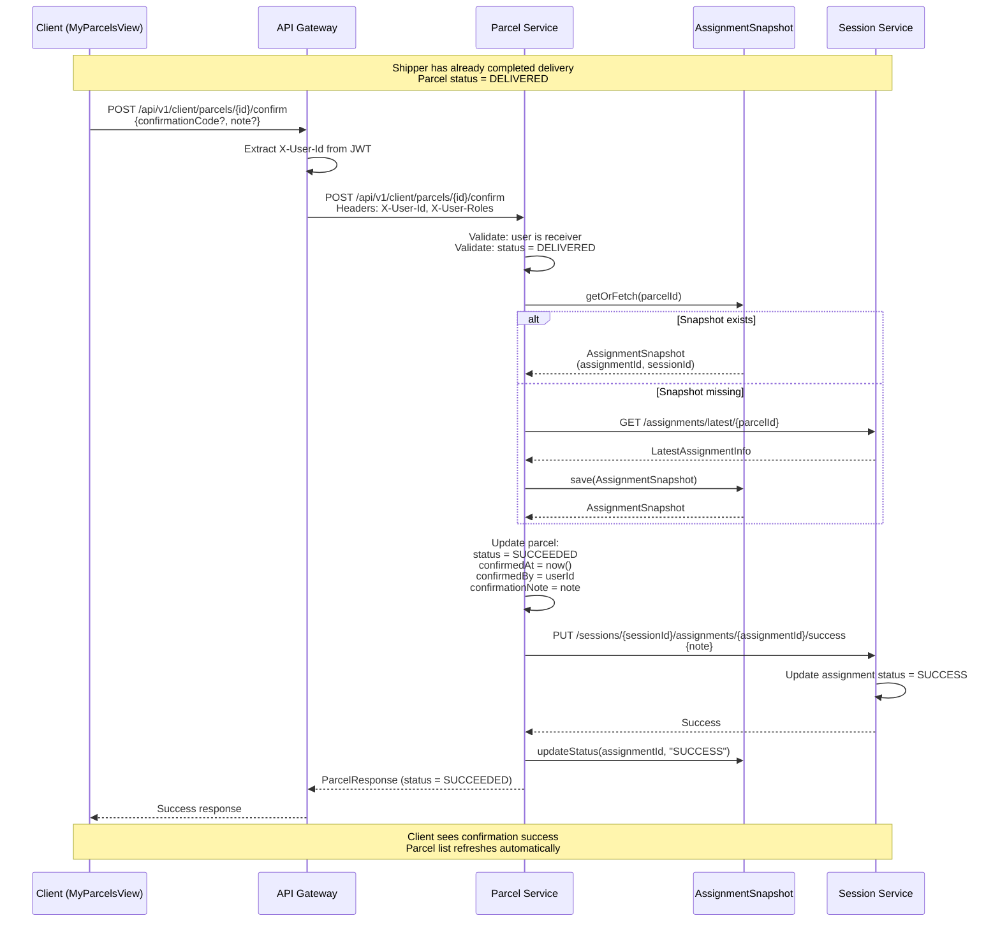

**Navigation**: [ Back to client Features](README.md) | [ Features Index](../README.md) | [ Report Index](../../README.md)

---

# Client: Confirm Delivery & Dispute

**Version**: v1  
**Module**: `ManagementSystem/src/modules/Client`  
**Related**: See `../../SYSTEM_ANALYSIS.md` for system analysis

## Overview

Client confirms receipt of parcel after shipper has completed delivery. This updates parcel status to `SUCCEEDED` and marks assignment as `SUCCESS`.

## Activity Diagram

## Sequence Diagram

## Implementation Details

**Client-scoped parcel API** (`/api/v1/client/parcels/*`):
- Automatically filters parcels by `receiverId` from JWT (`X-User-Id` header)
- Enforces authorization: clients can only view/confirm their own received parcels
- Uses V2 paging/filtering for advanced queries

**Snapshot strategy for cross-service queries**:
- `AssignmentSnapshot` entity in Parcel Service caches assignment metadata locally
- Reduces synchronous calls to Session Service during confirmation flow
- Snapshot is populated via:
  1. Initial fetch from Session Service when needed
  2. Future: Kafka events from Session Service (to be implemented)
- Used in `confirmParcelByClient()` to retrieve `assignmentId` and `sessionId` without blocking on Session Service

## Code References

- **Frontend**: `ManagementSystem/src/modules/Client/MyParcelsView.vue`
- **API Gateway**: `BE/api-gateway/src/main/java/com/ds/gateway/application/controllers/v1/ClientParcelController.java`
- **Parcel Service**: `BE/parcel-service/src/main/java/com/ds/parcel_service/application/controllers/client/ClientParcelController.java`
- **Business Logic**: `BE/parcel-service/src/main/java/com/ds/parcel_service/business/v1/services/ParcelService.java#confirmParcelByClient`
- **Snapshot Service**: `BE/parcel-service/src/main/java/com/ds/parcel_service/application/services/AssignmentSnapshotService.java`

## API References

- **Gateway**: `POST /api/v1/client/parcels/{id}/confirm` (see [API Gateway V1 CLIENT_DELIVERY_SESSION_CONTROLLER Controller](../../3_APIS_AND_FUNCTIONS/apis/api-gateway/v1/V1_CLIENT_DELIVERY_SESSION_CONTROLLER.md))

## Backlog

- Add confirmation code validation (if provided by shipper during delivery)
- Support dispute flow for incorrect deliveries

---

**Navigation**: [ Back to client Features](README.md) | [ Features Index](../README.md) | [ Report Index](../../README.md)