**Navigation**: [ Back to client Features](README.md) | [ Features Index](../README.md) | [ Report Index](../../README.md)

---

# Client: Create & Assign Parcel

**Version**: v1  
**Module**: `ManagementSystem/src/modules/Client`  
**Related**: See `reports/2_BACKEND/3_PARCEL_SERVICE.md` for service details

## Overview

Client creates a new parcel by filling out a form with sender/receiver addresses and parcel details. Parcel is created with status `IN_WAREHOUSE` and can be assigned to a delivery session.

## Activity Diagram

```mermaid
flowchart TD
    A["Client selects Create Parcel"] --> B["Fill form + pick sender/receiver addresses"]
    B --> C["POST /v1/parcels (API Gateway → Parcel Service)"]
    C --> D["Parcel status = IN_WAREHOUSE"]
    D --> E["Admin schedules via Session Service or shipper scans QR"]
    E --> F["Client receives notification + chat thread"]
```

## Code References

- **Frontend**: `ManagementSystem/src/modules/Client/CreateParcelView.vue`
- **API Client**: `ManagementSystem/src/modules/Parcels/api.ts`
- **Backend**: `BE/parcel-service/src/main/java/com/ds/parcel_service/application/controllers/ParcelController.java`

## API References

- **Gateway**: `POST /api/v1/parcels` (see [API Gateway V1 PARCEL_SERVICE_CONTROLLER Controller](../../3_APIS_AND_FUNCTIONS/apis/api-gateway/v1/V1_PARCEL_SERVICE_CONTROLLER.md))
- **Parcel Service**: V1 controller (see [Parcel Service V1 PARCEL_CONTROLLER Controller](../../3_APIS_AND_FUNCTIONS/apis/parcel-service/v1/PARCEL_SERVICE_V1_PARCEL_CONTROLLER.md))

## Implementation Notes

- Client must have sender and receiver addresses configured
- Parcel is created with status `IN_WAREHOUSE` and awaits assignment
- Zone Service resolves routing cells automatically
- Client receives notification when parcel is assigned to a session

---

**Navigation**: [ Back to client Features](README.md) | [ Features Index](../README.md) | [ Report Index](../../README.md)