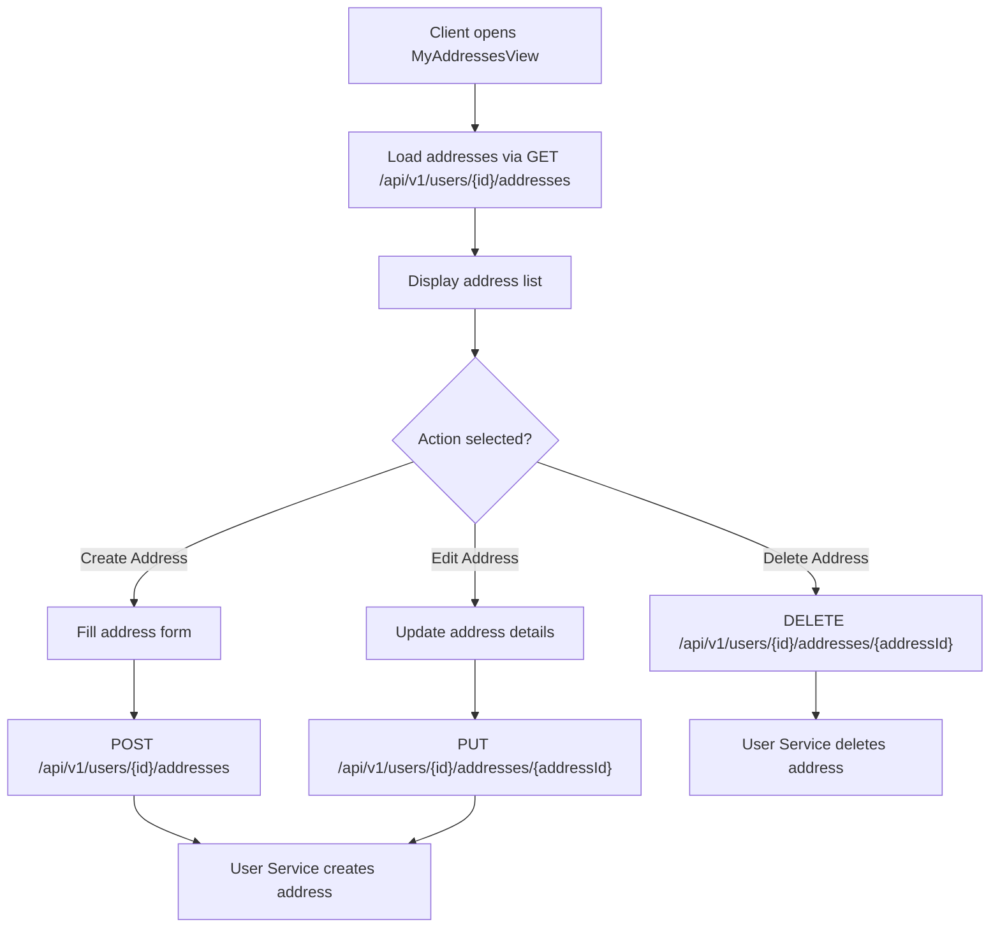

**Navigation**: [ Back to client Features](README.md) | [ Features Index](../README.md) | [ Report Index](../../README.md)

---

# Client: Manage Addresses

**Version**: v1  
**Module**: `ManagementSystem/src/modules/Client`  
**Related**: See `reports/2_BACKEND/6_USER_SERVICE.md` for service details

## Overview

Client can create, edit, and manage their addresses. Addresses are used when creating parcels as sender or receiver locations.

## Activity Diagram

## Code References

- **Frontend**: `ManagementSystem/src/modules/Client/MyAddressesView.vue`
- **Backend**: `BE/User_service/src/main/java/`

## API References

- **Gateway**: 
  - `GET /api/v1/users/{id}/addresses` - List addresses
  - `POST /api/v1/users/{id}/addresses` - Create address
  - `PUT /api/v1/users/{id}/addresses/{addressId}` - Update address
  - `DELETE /api/v1/users/{id}/addresses/{addressId}` - Delete address
  - See [API Gateway V1 USER_ADDRESS_PROXY_CONTROLLER Controller](../../3_APIS_AND_FUNCTIONS/apis/api-gateway/v1/V1_USER_ADDRESS_PROXY_CONTROLLER.md)

## Features

- **CRUD Operations**: Full create, read, update, delete support
- **Address Validation**: Validate address format and coordinates
- **Default Address**: Set default sender/receiver address
- **Zone Integration**: Addresses are linked to delivery zones

---

**Navigation**: [ Back to client Features](README.md) | [ Features Index](../README.md) | [ Report Index](../../README.md)