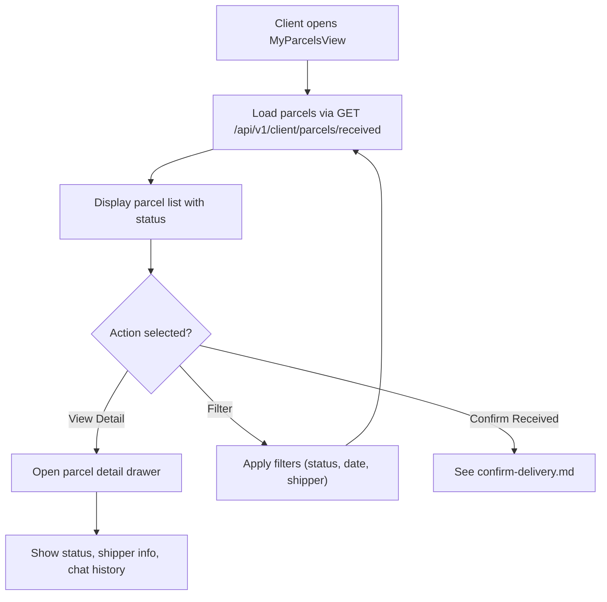

**Navigation**: [ Back to client Features](README.md) | [ Features Index](../README.md) | [ Report Index](../../README.md)

---

# Client: Track Parcels

**Version**: v1  
**Module**: `ManagementSystem/src/modules/Client`  
**Related**: See `reports/2_BACKEND/3_PARCEL_SERVICE.md` for service details

## Overview

Client can view and track all parcels they are receiving. Parcels are automatically filtered by `receiverId` from JWT token.

## Activity Diagram

## Code References

- **Frontend**: `ManagementSystem/src/modules/Client/MyParcelsView.vue`
- **API Client**: `ManagementSystem/src/modules/Parcels/api.ts`
- **Backend**: `BE/parcel-service/src/main/java/com/ds/parcel_service/application/controllers/client/ClientParcelController.java`

## API References

- **Gateway**: `GET /api/v1/client/parcels/received` (see [API Gateway V1 CLIENT_DELIVERY_SESSION_CONTROLLER Controller](../../3_APIS_AND_FUNCTIONS/apis/api-gateway/v1/V1_CLIENT_DELIVERY_SESSION_CONTROLLER.md))
- **Parcel Service**: Client-scoped endpoints (see [Parcel Service V1 PARCEL_CONTROLLER Controller](../../3_APIS_AND_FUNCTIONS/apis/parcel-service/v1/PARCEL_SERVICE_V1_PARCEL_CONTROLLER.md))

## Features

- **Automatic Filtering**: Parcels filtered by `receiverId` from JWT
- **Status Tracking**: View parcel status transitions
- **Filter Support**: V2 filter system for advanced queries
- **Real-time Updates**: WebSocket notifications for status changes

## Known Issues

1. **Missing shipperId filter** (see `../../SYSTEM_ANALYSIS.md` section 3):
   - Cannot filter parcels by `shipperId` + `receiverId` to see "parcels delivered by this shipper to me"
   - Fix: Extend Parcel Service search to accept `shipperId`, update API client, and add filter chips

## Backlog

- Add filter chips (delivered, on-route, delayed) with V2 filter syntax
- Provide "exclude current parcel" parameter when fetching sessions
- Support quick actions from chat to open `ParcelDetail` drawer

---

**Navigation**: [ Back to client Features](README.md) | [ Features Index](../README.md) | [ Report Index](../../README.md)