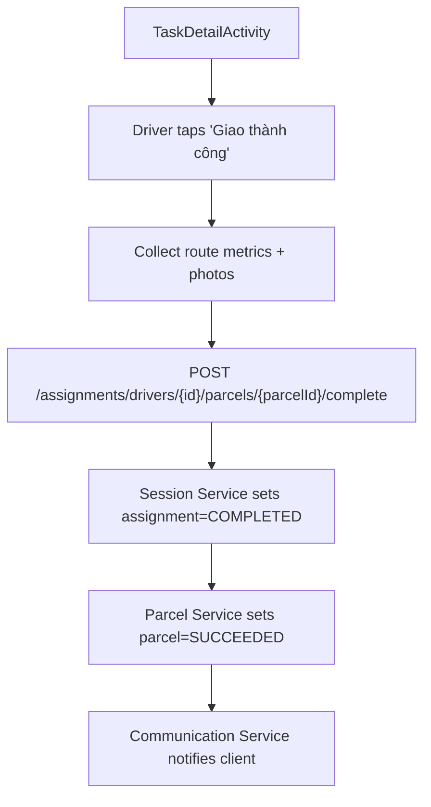
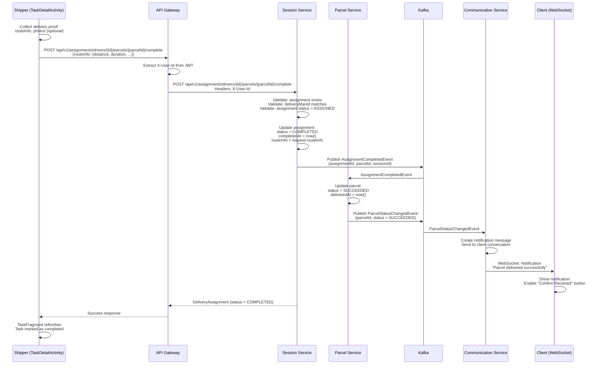

**Navigation**: [← Back to Shipper Features](README.md) | [↑ Features Index](../README.md) | [↑ Report Index](../../README.md)

---

# Shipper: Complete Task & Confirm Proof

**Version**: v1  
**Module**: `DeliveryApp/app/src/main/java/com/ds/deliveryapp`  
**Related**: See [Session Service Documentation](../../2_BACKEND/4_SESSION_SERVICE.md) for service details

## Overview

Shipper marks a delivery task as completed after successfully delivering the parcel. This updates assignment status to `COMPLETED` and parcel status to `SUCCEEDED`, notifying the client.

## Activity Diagram

## Sequence Diagram

## Code References

- **API**: `SessionClient.completeTask`
- **Activity**: `DeliveryApp/app/src/main/java/com/ds/deliveryapp/TaskDetailActivity.java`
- **Backend**: `BE/session-service/src/main/java/com/ds/session/session_service/application/controllers/DeliveryAssignmentController.java`

## API References

- **Gateway**: `POST /api/v1/assignments/drivers/{id}/parcels/{parcelId}/complete` (see [API Gateway V1 Delivery Assignment Controller](../../3_APIS_AND_FUNCTIONS/apis/api-gateway/v1/V1_DELIVERY_ASSIGNMENT_CONTROLLER.md))
- **Session Service**: V1 controller (see [Session Service V1 Delivery Assignment Controller](../../3_APIS_AND_FUNCTIONS/apis/session-service/v1/SESSION_SERVICE_V1_DELIVERY_ASSIGNMENT_CONTROLLER.md))

## Implementation Notes

- Route info (distance, duration) is collected and stored with assignment
- Photos are optional but recommended for proof
- Client receives WebSocket notification immediately after completion

---

**Navigation**: [← Back to Shipper Features](README.md) | [↑ Features Index](../README.md) | [↑ Report Index](../../README.md)
