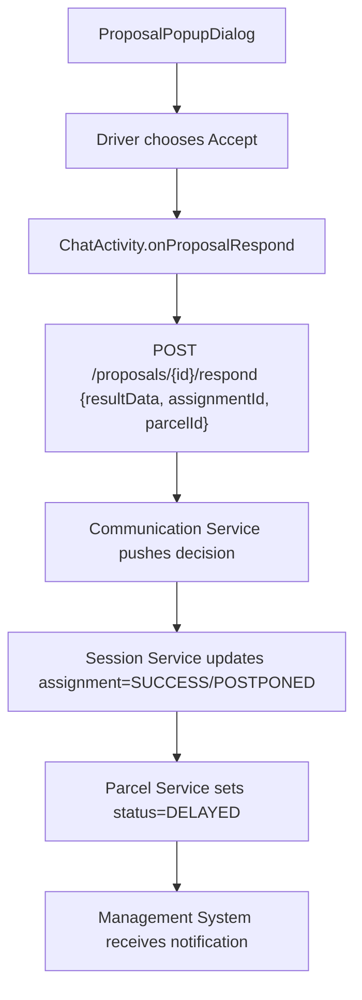

**Navigation**: [ Back to shipper Features](README.md) | [ Features Index](../README.md) | [ Report Index](../../README.md)

---

# Shipper: Handle Postpone Proposal

**Version**: v1  
**Module**: `DeliveryApp/app/src/main/java/com/ds/deliveryapp`  
**Related**: See `../../SYSTEM_ANALYSIS.md` for system analysis and recommendations

## Overview

Shipper responds to postpone proposals from admin/client. When accepting a postpone request, the assignment status is updated to `POSTPONED` and parcel is marked as `DELAYED`.

## Activity Diagram

## Code References

- **Activity**: `DeliveryApp/app/src/main/java/com/ds/deliveryapp/ChatActivity.java`
- **Service**: `DeliveryApp/app/src/main/java/com/ds/deliveryapp/service/GlobalChatService.java`

## Known Issues & Fixes Required

1. **Missing assignmentId in proposal response** (see `../../SYSTEM_ANALYSIS.md` section 3):
   - Currently only `parcelId` is included in `resultData`
   - Fix: Include both `assignmentId` and `parcelId` in `resultData` payload before calling `respondToProposal`
   - Location: `ChatActivity.java` lines 1093-1108

2. **Status alignment**:
   - When shipper triggers postpone via quick action, also call `SessionClient.failTask/completeTask` depending on admin response to keep statuses aligned

## API References

- **Communication Service**: `POST /api/v1/proposals/{id}/respond` (see [Communication Service V1 PROPOSAL_CONTROLLER Controller](../../3_APIS_AND_FUNCTIONS/apis/communication-service/v1/COMMUNICATION_SERVICE_V1_PROPOSAL_CONTROLLER.md))
- **Session Service**: `PUT /api/v1/assignments/{assignmentId}/postpone` (to be implemented, see `../../SYSTEM_ANALYSIS.md`)

## Implementation Notes

- Proposal response must include both `assignmentId` and `parcelId` for backend to correctly update the assignment
- Backend will validate proposal exists and user has permission to respond

---

**Navigation**: [ Back to shipper Features](README.md) | [ Features Index](../README.md) | [ Report Index](../../README.md)