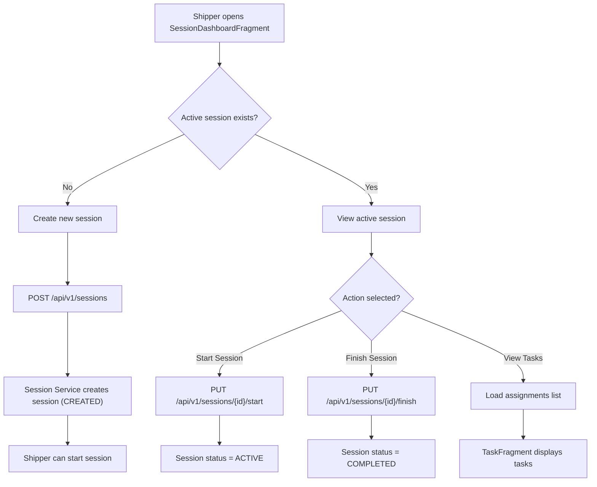

**Navigation**: [ Back to shipper Features](README.md) | [ Features Index](../README.md) | [ Report Index](../../README.md)

---

# Shipper: Manage Delivery Session

**Version**: v1  
**Module**: `DeliveryApp/app/src/main/java/com/ds/deliveryapp`  
**Related**: See `reports/2_BACKEND/4_SESSION_SERVICE.md` for service details

## Overview

Shipper can create, start, and finish delivery sessions. Sessions contain multiple assignments (parcels) and track delivery progress.

## Key Surfaces

- `SessionDashboardFragment` – session bootstrap (create/start/finish)
- `TaskFragment` – assignment list + status updates
- `TaskDetailActivity` – individual task details

## Session Lifecycle

1. **CREATED**: Session created but not started
2. **ACTIVE**: Session started, shipper is delivering
3. **COMPLETED**: All assignments completed
4. **FAILED**: Session failed or cancelled

## Activity Diagram

## Code References

- **Fragment**: `DeliveryApp/app/src/main/java/com/ds/deliveryapp/SessionDashboardFragment.java`
- **API**: `SessionClient.createSessionPrepared`, `SessionClient.startSession`
- **Backend**: `BE/session-service/src/main/java/com/ds/session/session_service/application/controllers/SessionController.java`

## API References

- **Gateway**: 
  - `POST /api/v1/sessions` - Create session
  - `PUT /api/v1/sessions/{id}/start` - Start session
  - `PUT /api/v1/sessions/{id}/finish` - Finish session
  - See [API Gateway V1 DELIVERY_SESSION_CONTROLLER Controller](../../3_APIS_AND_FUNCTIONS/apis/api-gateway/v1/V1_DELIVERY_SESSION_CONTROLLER.md)

## Implementation Notes

- Sessions can be created manually or automatically when accepting first parcel
- Active session is required for accepting new parcels
- Finishing session marks all remaining assignments appropriately

---

**Navigation**: [ Back to shipper Features](README.md) | [ Features Index](../README.md) | [ Report Index](../../README.md)