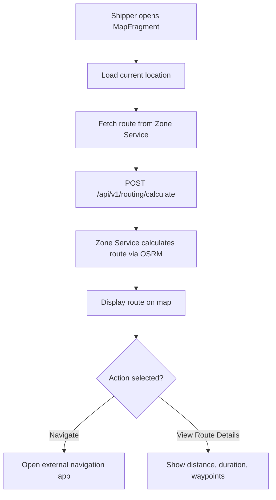

**Navigation**: [ Back to shipper Features](README.md) | [ Features Index](../README.md) | [ Report Index](../../README.md)

---

# Shipper: Navigation & Routing

**Version**: v1  
**Module**: `DeliveryApp/app/src/main/java/com/ds/deliveryapp`  
**Related**: See `reports/2_BACKEND/7_ZONE_SERVICE.md` for routing service

## Overview

Shipper can view routes, get navigation directions, and see delivery locations on map. Integration with Zone Service for route calculation and OSRM for navigation.

## Key Surfaces

- `MapFragment` – routing and navigation preview
- `TaskDetailActivity` – shows route to specific delivery location

## Activity Diagram

## Code References

- **Fragment**: `DeliveryApp/app/src/main/java/com/ds/deliveryapp/MapFragment.java`
- **Backend**: `BE/zone_service/src/`

## API References

- **Gateway**: `POST /api/v1/routing/calculate` (see [API Gateway V1 ZONE_PROXY_CONTROLLER Controller](../../3_APIS_AND_FUNCTIONS/apis/api-gateway/v1/V1_ZONE_PROXY_CONTROLLER.md))
- **Zone Service**: V1 routing router (see [Zone Service V1 ROUTING_ROUTER Controller](../../3_APIS_AND_FUNCTIONS/apis/zone-service/v1/ZONE_SERVICE_V1_ROUTING_ROUTER.md))

## Features

- **Route Calculation**: Calculate optimal route between multiple delivery locations
- **Map Display**: Show route on interactive map
- **Navigation Integration**: Open external navigation apps (Google Maps, OSRM)
- **Route Optimization**: Optimize delivery order for efficiency

## Upcoming (v2)

- Unified navigation intent that opens OSRM/Google Maps with coordinates from Zone Service
- Offline route caching
- Real-time route updates based on traffic

---

**Navigation**: [ Back to shipper Features](README.md) | [ Features Index](../README.md) | [ Report Index](../../README.md)