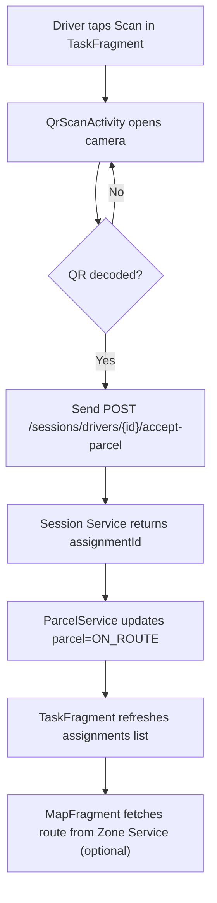
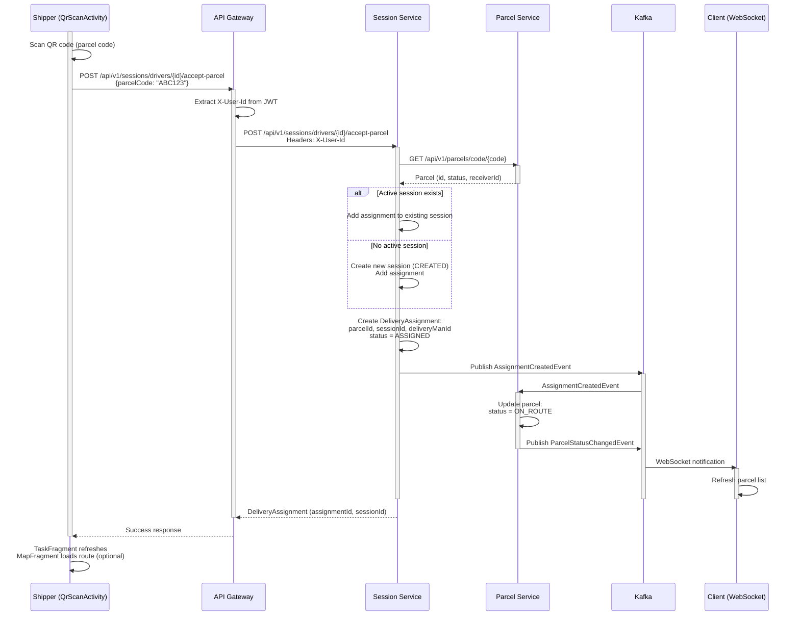

**Navigation**: [← Back to Shipper Features](README.md) | [↑ Features Index](../README.md) | [↑ Report Index](../../README.md)

---

# Shipper: Scan & Accept Parcel

**Version**: v0/v1  
**Module**: `DeliveryApp/app/src/main/java/com/ds/deliveryapp`  
**Related**: See [Delivery App Documentation](../../1_CLIENTS/2_DELIVERY_APP.md) for app structure

## Overview

Shipper scans QR code on parcel to accept it into their delivery session. This creates or adds to an active session and marks parcel as `ON_ROUTE`.

## Activity Diagram

## Sequence Diagram

## Code References

- **API**: `SessionClient.acceptParcelToSession`
- **Activity**: `DeliveryApp/app/src/main/java/com/ds/deliveryapp/QrScanActivity.java`
- **Fragment**: `DeliveryApp/app/src/main/java/com/ds/deliveryapp/TaskFragment.java`
- **Backend**: `BE/session-service/src/main/java/com/ds/session/session_service/application/controllers/SessionController.java`

## Implementation Notes

- `TaskFragment` should call `SessionDashboardFragment#createSession` if no active session exists
- Route fetching from Zone Service is optional and can be done asynchronously
- QR code contains parcel code, not parcel ID

## API References

- **Gateway**: `POST /api/v1/sessions/drivers/{id}/accept-parcel` (see [API Gateway V1 Session Controller](../../3_APIS_AND_FUNCTIONS/apis/api-gateway/v1/V1_SESSION_CONTROLLER.md))
- **Session Service**: V1 controller (see [Session Service V1 Session Controller](../../3_APIS_AND_FUNCTIONS/apis/session-service/v1/SESSION_SERVICE_V1_SESSION_CONTROLLER.md))

---

**Navigation**: [← Back to Shipper Features](README.md) | [↑ Features Index](../README.md) | [↑ Report Index](../../README.md)
